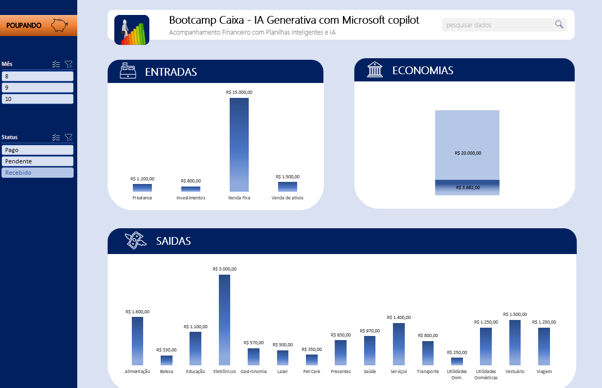

# Planilha_Inteligente

    <a href="https://github.com/roseangelly/Planilha_Inteligente_IA/raw/refs/heads/main/Projeto%20Planilha.xlsx> Planilha Inteligente 💵</a>

    <audio src="output/podcast_editado.MP3" controls title="Podcast editado"></audio>

# 📊 Projeto:
# Como organizar sua vida Financeira com Planilhas Inteligentes

Fala galera! 😁 Esse trabalho faz parte de uma das atividades desenvolvidas durante o Bootcamp Caixa-IA Generativa com Microsoft Copilot no DIO e foi ministrado por Felipe Aguiar
Tech Educator, DIO

Tem como objetivo capacitar pessoas a melhorarem o controle de suas finanças usando planilhas inteligentes e recursos de Inteligência Artificial 
para monitorar gastos, categorizar despesas e estabelecer metas de economia. As planilhas oferecem uma visão prática e personalizada, 
ajudando cada pessoa a tomar decisões financeiras mais informadas e eficientes.

## 💻 Ferramenta utilizada

- Microsoft Excel

## 📚 Material utilizado

- https://hermes.dio.me/files/assets/f631a203-25c9-46c0-8ce9-ce6933cc87b3.xlsx

## 👨‍💻 Aprendiz

    
    
&nbsp&nbsp&nbspRose Angelly 
    &nbsp&nbsp&nbsp
    <a href="https://github.com/roseangelly">
    GitHub</a>&nbsp;|&nbsp;
    <a href="https://www.linkedin.com/in/
rose-angelly-cabral-022059225">LinkedIn</a>
&nbsp;|&nbsp;
    <a href="https://www.instagram.com/rose.angelly/profilecard/?igsh=MXZ5bxOTIxeGIndw==/">
    Instagram</a>
&nbsp;|&nbsp;

  

---

⌨️ com ❤️ de alguém que gosta de poupar para viajar e curiosa no mundo da IA [Rose Angelly](https://github.com/roseangelly)
